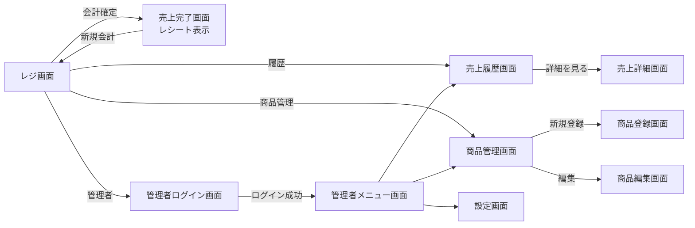

## 画面一覧

| No | 画面名       | URL例                 | 主な役割              |
| -: | --------- | -------------------- | ----------------- |
|  1 | レジ画面      | `/pos`               | 商品選択、注文内容確認、会計確定  |
|  2 | 売上完了画面    | `/pos/complete`      | 会計完了後のレシート表示      |
|  3 | 売上履歴画面    | `/sales/history`     | 過去の売上一覧を確認        |
|  4 | 売上詳細画面    | `/sales/:id`         | 1件の売上内容・レシート詳細を確認 |
|  5 | 売上管理画面    | `/sales`             | 日別・月別売上、集計、検索     |
|  6 | 商品管理画面    | `/products`          | 商品一覧、登録、編集、削除     |
|  7 | 商品登録画面    | `/products/create`   | 新規商品の登録           |
|  8 | 商品編集画面    | `/products/:id/edit` | 商品名、価格、カテゴリ等の編集   |
|  9 | カテゴリ管理画面  | `/categories`        | フード、ドリンク等のカテゴリ管理  |
| 10 | 管理者ログイン画面 | `/login`             | 管理者認証             |
| 11 | 管理者メニュー画面 | `/admin`             | 売上管理・商品管理などへの入口   |
| 12 | 設定画面      | `/settings`          | 税率、店舗名、レシート設定など   |

## 最低限必要な画面

| 優先度 | 画面名         |
| --- | ----------- |
| 高   | レジ画面        |
| 高   | 売上完了・レシート表示 |
| 高   | 売上履歴        |
| 高   | 売上詳細        |
| 高   | 商品管理        |
| 中   | 商品登録・編集     |
| 中   | 売上管理        |
| 低   | カテゴリ管理      |
| 低   | 設定画面        |

## 画面遷移イメージ

